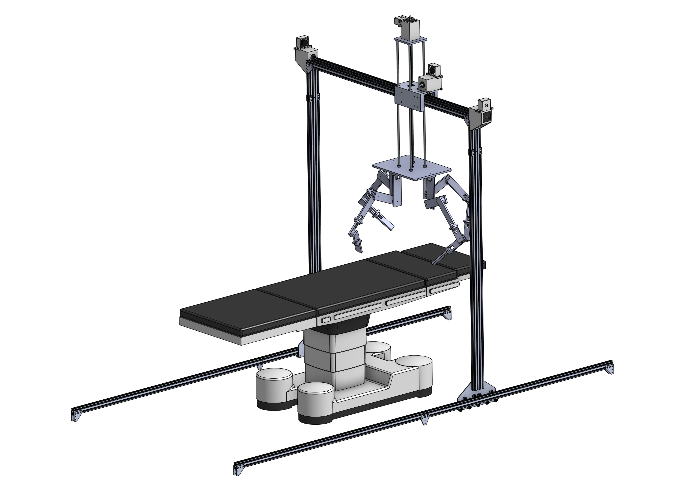

# SurgeyOS ROS2 Workspace

SurgeyOS: Surgery Operating System, an Experimental research surgery robotics




## Documentation

- Docs entry: `docs/README.md`
- Docsify app shell: `docs/index.html`
- Sidebar nav: `docs/_sidebar.md`

Main sections:
- [Getting Started](docs/getting-started.md)
- [Simulation](docs/simulation.md)
- [Troubleshooting](docs/troubleshooting.md)
- [Raspberry Pi Setup](docs/raspberry-pi-setup.md)
- [Video Streaming](docs/video-streaming.md)
- [Foxglove Bridge](docs/foxglove.md)
- [Hardware](docs/hardware.md)

## Quickstart

```bash
ros2 launch surgery surgery.launch.py
```
